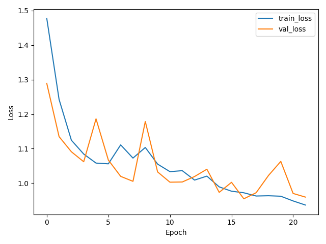
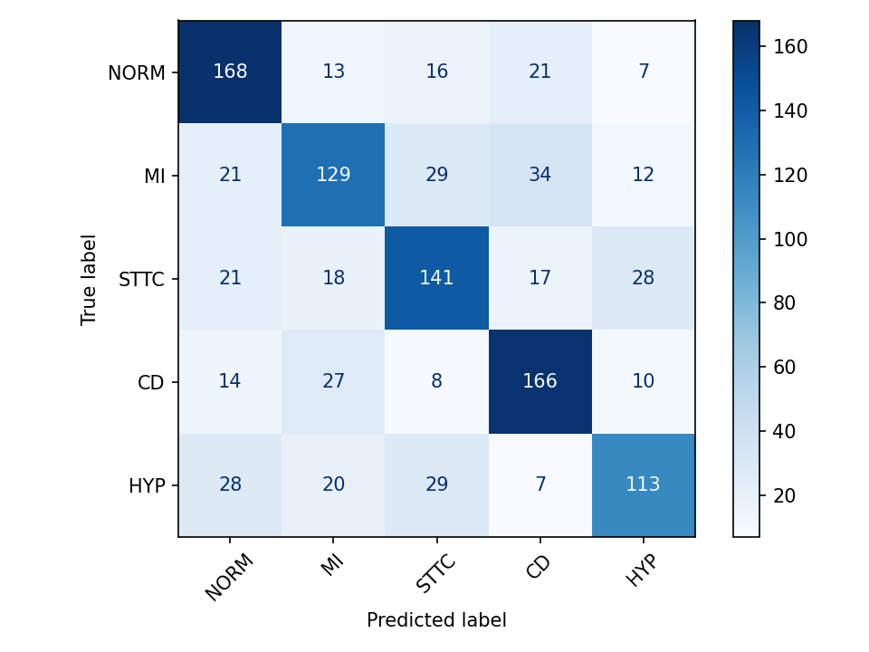

```{r setup, include=FALSE}
knitr::opts_chunk$set(
  echo = FALSE,
  message = FALSE,
  warning = FALSE,
  fig.width = 5,      # inches
  fig.height = 3,     # inches
  out.width = "60%",  # shrink in LaTeX
  fig.align = "center"
)

```
## Abstract 
Electrocardiography (ECG) remains a frontline diagnostic tool for identifying rhythm abnormalities and structural or ischemic patterns; however, timely interpretation is constrained by clinical workload and variability in human reading, motivating automated triage systems that can flag high-risk presentations for earlier review. Deep learning, particularly convolutional neural networks (CNNs), has demonstrated strong performance in arrhythmia detection and multi-class ECG interpretation, suggesting feasibility for decision support in screening and prioritization workflows (Ansari et al., 2023; Hannun et al., 2019). In this project, we evaluate whether a 1D CNN can classify clinically common diagnostic categories from short standard ECG recordings using the PTB-XL database, a large public collection of 10-second, 12-lead ECGs annotated according to SCP-ECG statements and aggregated into diagnostic groupings (Wagner et al., 2020).

Using PTB-XL metadata, SCP diagnostic codes were grouped into five clinically meaningful diagnostic superclasses. Raw 12-lead ECG waveforms sampled at 500 Hz were preprocessed using a bandpass filter to remove baseline drift and high-frequency noise, with optional downsampling to reduce computational burden. Because the dataset is highly imbalanced across diagnostic categories, a balanced subset was constructed and a 1D convolutional neural network was trained using class-weighted loss and early stopping. Model performance was evaluated using accuracy, precision, recall, F1-score, and confusion matrices. While overall accuracy reached moderate levels, recall for less common diagnostic categories remained limited, highlighting the challenges of collapsing inherently multi-label clinical ECG annotations into single-label classification tasks. These results emphasize the importance of label design and imbalance handling and motivate further refinement of the modeling approach to improve sensitivity for underrepresented but clinically important diagnostic patterns.

## Introduction 

Cardiac arrhythmias and other electrocardiographic abnormalities remain a substantial contributor to preventable morbidity, emergency department utilization, and long-term cardiovascular complications, particularly in clinical settings where rapid interpretation and high patient volume increase the likelihood that subtle or transient abnormalities may go undetected (Chugh et al., 2014; Benjamin et al., 2019). Among these conditions, atrial fibrillation (AF) poses a unique clinical challenge, as its paroxysmal nature frequently results in missed detection outside symptomatic episodes, despite well-established associations with thromboembolic events, heart failure, and increased mortality when left untreated (Hindricks et al., 2021). Because timely ECG interpretation relies heavily on expert visual assessment and contextual judgment, delays or oversights in identifying clinically meaningful patterns can have significant downstream consequences. In this context, automated ECG analysis tools have the potential to support clinical decision-making by flagging abnormal recordings for prioritized review rather than replacing clinician interpretation outright (Topol, 2019).

To address issues of reproducibility, scale, and standardized evaluation in ECG machine learning, this project utilizes the PTB-XL electrocardiography database. PTB-XL is a publicly available collection of 10-second, 12-lead clinical ECG recordings annotated using the SCP-ECG standard by trained experts, with accompanying metadata and recommended data splits designed to support benchmarking and comparative studies (PhysioNet, n.d.; Wagner et al., 2020). The size and diversity of the dataset, combined with its structured labeling scheme, make it particularly well suited for investigating supervised learning pipelines that map raw ECG waveforms to clinically interpretable diagnostic categories while preserving real-world complexity.

The primary clinical question guiding this work is whether a convolutional neural network can accurately classify common ECG diagnostic categories in a manner that supports early identification and triage of arrhythmias relevant to conditions such as atrial fibrillation. Although PTB-XL includes both rhythm-level and diagnostic-level annotations, the initial modeling strategy focuses on classifying recordings into five broad diagnostic superclasses: Normal, Myocardial Infarction, ST/T Changes, Conduction Disturbance, and Hypertrophy, as defined in prior PTB-XL benchmarking studies (Wagner et al., 2020). We develop a reproducible end-to-end pipeline that links SCP codes to superclass labels, applies signal preprocessing to reduce baseline drift and high-frequency noise, addresses severe class imbalance through balanced sampling and class-weighted loss, and trains a one-dimensional CNN evaluated using standard performance metrics and confusion matrices. This framework serves as a foundation for subsequent refinement, including more nuanced label strategies and rhythm-focused endpoints, and highlights the challenges inherent in collapsing multi-label clinical ECG annotations into single-label classification tasks for automated triage.

## Methods

This study was done in three phases: data processing, model building, and model validation.
Data processing started with reading in the waveform data. We loaded the raw 12-lead ECG signal for each record using the WFDB library, then a first-order Butterworth bandpass filter of size 0.5–40 Hz at 500 Hz to reduce baseline drift and high-frequency noise. 

Diagnostic superclasses were defined using the official PTB-XL’s mapping. We kept non-missing diagnostic class rows, and created a super-class definition for the following five ECG classifications: Normal (NORM), Myocardial Infarction (MI), ST/T Changes (STTC), Conduction Disturbance (CD), and Hypertrophy (HYP). Because NORM was much more common than the other categories, we constructed a balanced analysis set by sampling up to 1,500 ECGs per superclass. The resulting subset contained roughly equal representation of the five superclasses and was shuffled prior to model training.

Model building started with a framework for a traditional 1D CNN which was adapted for this data where an ECG reading could belong to multiple superclasses. We used TensorFlow/ Keras in Python to build our model, which will accept a (T, 12) shaped tensor, where T corresponds to the number of time points for each ECG reading. In this case, we were using 10-second readings of 500 Hz, therefore T is 5,000. 

The architecture consisted of three sequential convolutional blocks. Each block contained a Conv1D layer with kernel size 7, ReLU activation, followed by max-pooling of pool size 2. The number of filters increased with depth in the following sequence: 32, 64, 128. Each block functioned to reduce the temporal dimension while increasing the number of filters, which was chosen to help the CNN process more abstract features of the ECG signals. After the last convolutional block, a global pooling was applied to summarize the learned features. Then, a dense layer with 128 units and ReLU activation and a dropout layer with a rate of 0.5 was added to mitigate overfitting possibilities. The output layer of the CNN is a dense layer with 5 units and a softmax activation. This creates a probability distribution over the five diagnostic superclasses. The model was compiled using the Adam optimizer with a learning rate of 0.001, sparse categorical crossentropy loss, and accuracy as the primary training metrics. 

The balanced dataset was split into a training, validation, and test set using scikit-learn’s train_test_split function. We stratified by the superclass label to preserve class balance in each data split. Final proportions of the data were: 70% training, 15% validation, and 15% test. The seed was set to 42 for reproducibility purposes. For a more robust split, we computed class weights on the training labels, and used these to re-weight the loss contributions from each class to reduce bias to over-represented superclasses. 

The CNN was trained for a maximum of 40 epochs with a batch size of 32. To further control overfitting and improve stability, early stopping was allowed and learning rate scheduling was implemented. Early stopping was allowed if validation loss did not improve for 5 consecutive epochs, choosing the model weights from the epoch with the lowest validation loss. Learning rate was halved if validation loss did not improve for 3 epochs, with a minimum rate of 0.00001. For each split: loss and accuracy, predicted class labels, a classification report (precision, recall, F-1), and a confusion matrix were produced. 

## Results 

Training and validation loss over the epochs is visualized in Figure 1. Both curves dropped quickly over the first few epochs and then decreased more slowly, with the validation loss following the training loss closely. The initial training and validation losses were about 1.48 and 1.29, respectively, and by the final epoch they were reduced to roughly 0.94 (train) and 0.96 (validation). The corresponding final accuracies were about 0.66 on both the training and validation sets, suggesting moderate fit without extreme overfitting.
```{r fig-loss-curve, echo=FALSE, fig.cap="Training and validation loss across epochs for the 1D CNN classifier."}

```
On the test set, the overall accuracy was approximately 0.65. Macro-averaged precision and recall were both around 0.65 as well, so the model did not strongly favor one diagnostic superclass at the expense of the others. This level of performance is consistent with what we see on the validation set and indicates that the model generalizes reasonably well to unseen ECGs drawn from the same distribution.
```{r fig-cm, echo=FALSE, fig.cap="Confusion Matrix for the Test Set."}

```
The confusion matrix for the test set is shown in Figure 2. NORM and CD had the highest recalls at about 0.75 and 0.74, respectively, meaning most truly normal and CD ECGs were correctly identified. MI, STTC, and HYP had lower recalls of 0.57–0.63, reflecting more frequent confusion with neighboring classes. Precision values were fairly similar across all superclasses at around 0.63–0.67, with slightly better precision for NORM and CD. Misclassifications most often involved STTC being predicted as other abnormal classes or as NORM, and HYP being confused with STTC and NORM, which is consistent with the visual overlap in these ECG patterns.
Overall, the CNN learned enough structure from the ECG waveforms to distinguish clearly normal from clearly abnormal tracings and to identify conduction disturbances relatively well, but struggled more with superclasses that have more nuanced ECG signal differences such as ST/T changes and hypertrophy.


## Conclusion 
This project implemented an end-to-end pipeline to automate the classification of 12-lead ECGs using a 1D CNN trained with the PTB-XL dataset. From raw waveform data, we created diagnostic superclass labels, a balanced subset, and applied preprocessing. Then, we trained a multiclass CNN with a preliminary architecture that was able to learn meaningful structure from the ECG signals and achieved an average performance across the five superclasses. Normal and myocardial infarction ECGs had the best classifications. The results also highlighted various limitations, such as performance dipping for more nuanced ECGs and multi-class potential of some ECGs that the model did not account for. This is a baseline framework that can be extended using the suggestions previously provided to reach a more clinically relevant model. 

## GitHub Repository
https://github.com/raoMedha/BIOSTAT625_Project

## References

Ansari, Y., Mourad, O., Qaraqe, K., & Serpedin, E. (2023). Deep learning for ECG arrhythmia detection and classification: An overview of progress for period 2017–2023. *Frontiers in Physiology*, 14, 1246746. https://doi.org/10.3389/fphys.2023.1246746  

Benjamin, E. J., Muntner, P., Alonso, A., Bittencourt, M. S., Callaway, C. W., Carson, A. P., Chamberlain, A. M., Chang, A. R., Cheng, S., Das, S. R., Delling, F. N., Djoussé, L., Elkind, M. S. V., Ferguson, J. F., Fornage, M., Jordan, L. C., Khan, S. S., Kissela, B. M., Knutson, K. L., … Virani, S. S. (2019). Heart disease and stroke statistics—2019 update: A report from the American Heart Association. *Circulation*, 139(10), e56–e528. https://doi.org/10.1161/CIR.0000000000000659  

Chugh, S. S., Havmoeller, R., Narayanan, K., Singh, D., Rienstra, M., Benjamin, E. J., Gillum, R. F., Kim, Y. H., McAnulty, J. H., Jr, Zheng, Z. J., Forouzanfar, M. H., Naghavi, M., Mensah, G. A., Ezzati, M., & Murray, C. J. (2014). Worldwide epidemiology of atrial fibrillation: A Global Burden of Disease 2010 study. *Circulation*, 129(8), 837–847. https://doi.org/10.1161/CIRCULATIONAHA.113.005119  

Hannun, A. Y., Rajpurkar, P., Haghpanahi, M., Tison, G. H., Bourn, C., Turakhia, M. P., & Ng, A. Y. (2019). Cardiologist-level arrhythmia detection and classification in ambulatory electrocardiograms using a deep neural network. *Nature Medicine*, 25(1), 65–69. https://doi.org/10.1038/s41591-018-0268-3  

Hindricks, G., Potpara, T., Dagres, N., Arbelo, E., Bax, J. J., Blomström-Lundqvist, C., Boriani, G., Castella, M., Dan, G.-A., Dilaveris, P. E., Fauchier, L., Filippatos, G., Kalman, J. M., La Meir, M., Lane, D. A., Lebeau, J.-P., Lettino, M., Lip, G. Y. H., Pinto, F. J., … Watkins, C. L. (2021). 2020 ESC guidelines for the diagnosis and management of atrial fibrillation developed in collaboration with the European Association for Cardio-Thoracic Surgery (EACTS). *European Heart Journal*, 42(5), 373–498. https://doi.org/10.1093/eurheartj/ehaa612  

PhysioNet. (n.d.). *PTB-XL, a large publicly available electrocardiography dataset* (version 1.0.3). Retrieved from https://physionet.org/content/ptb-xl/1.0.3/  

Topol, E. J. (2019). High-performance medicine: The convergence of human and artificial intelligence. *Nature Medicine*, 25, 44–56. https://doi.org/10.1038/s41591-018-0300-7  

Wagner, P., Strodthoff, N., Bousseljot, R.-D., Samek, W., & Schaeffter, T. (2020). PTB-XL, a large publicly available electrocardiography dataset. *Scientific Data*, 7, Article 154. https://doi.org/10.1038/s41597-020-0495-6  
